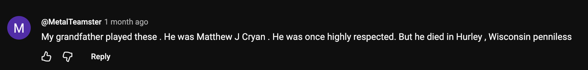

Key points:

In this, Cage wrote on the state of musical composition at the time and gave predictions on the future of music. With increasingly flexible methods of manipulating not just musical sounds, but any sound such as rain or the ambiance of a crowd - *sound effects* - emerging at the time, Cage believed that new paradigms of composition would emerge (and were emerging), focusing more on rhythm or perhaps something else as an organizing principle, rather than harmony. He wrote that composers of the age (this was first given as a lecture in 1937, later published in 1958) were too attached to established traditions to realize these new modes of music-making afforded by new technologies, in the same way that early automobiles were designed to emulate carriages.

Reflections:

Mainly, I'm turning over this text to consider which of Cage's predictions were correct or incorrect, now that it's been 89 years since this lecture was first given. I don't believe that we have abandoned harmony as a driving principle of composition, at least not yet. That said, it has been decentered in many genres of music. I'm thinking about early sampling pioneers like De La Soul, who made use of existing recorded material, much of which was "non-musical", including TV dialogue and other sound-effects, as Cage predicted. If you look at the musical landscape in 2026, this approach has become widespread, not just in rap music, but in much of pop music (which has been increasingly influenced by rap music year-over-year). A notable mainstream example would be Billie Eilish's *Bad Guy*, which samples [an Australian crosswalk](https://www.youtube.com/watch?v=m8xQlnsU9KM). 

I'm deliberating on Cage's prediction that "The 'frame' or fraction of a second, following established film technique, will probably be the basic unit in the measurement of time." I think this one might be a swing and a miss, but there is something to be said for the different ways one approaches time when composing via sheet music vs DAW. Personally, I have much more experience with a DAW, and I would say I still think about music in terms of measures, notes, quarter-notes, etc. But I wonder if DAWs have made the following sentence more correct, that "No rhythm will be beyond the composer's reach."

P.S. While looking up [[Schoenberg's Twelve-Tone System]] and Solovox clips on Youtube, I came across these excellent comment sections:

![[SCR-20260930-fzcw.png]]

