#fabrication #wood

The Assignment: make 5 identical items

With my theme being "rats", I was struggling to think of anything decent to make, but Elie suggested pizza slices which I thought was decently associated enough bc of pizza rat, and I went from there.

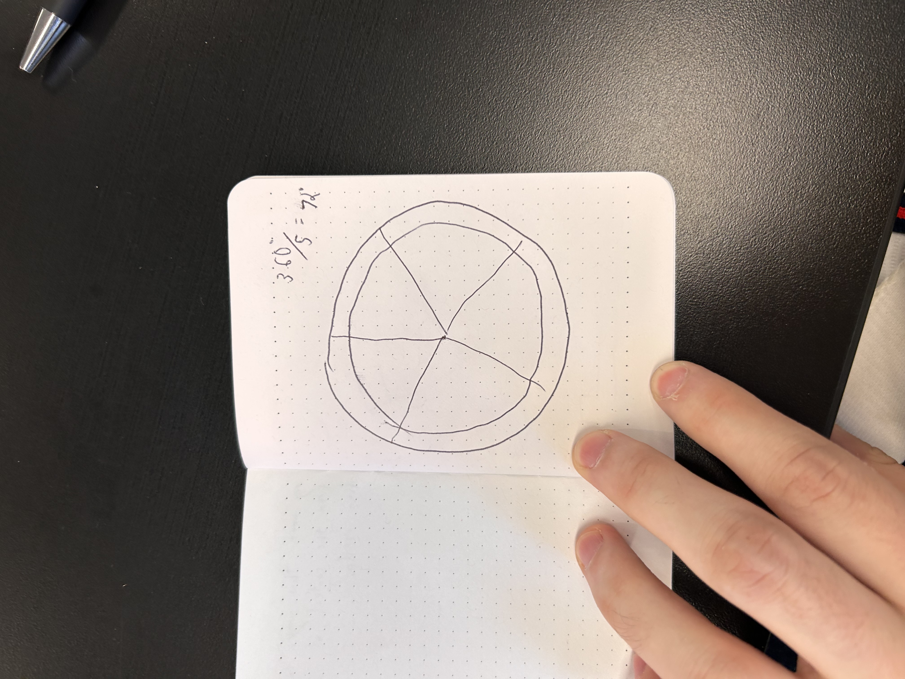

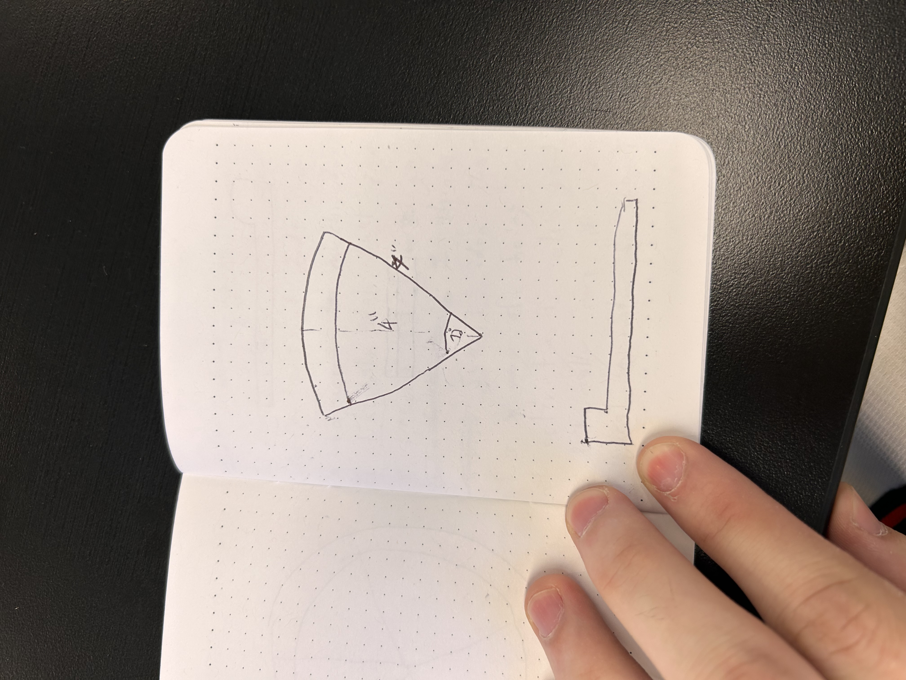

Went to go buy my own wood for this one with Avi

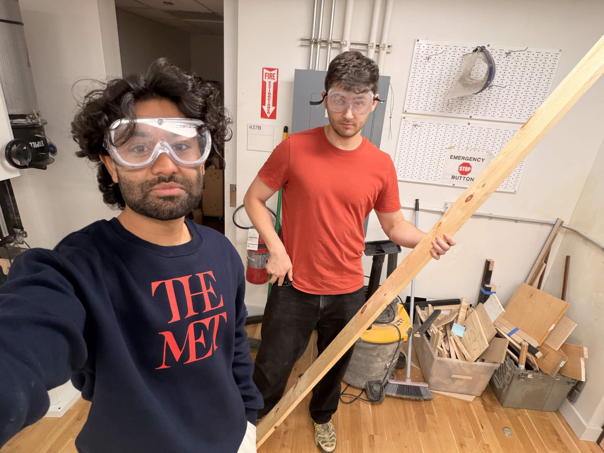

I did math for the first time in a long time and it didn't go great. The slices have to make a full circle, so that's 360°, and 5 slices means 72° per slice. That part is true. But then when I went to cut slices, I didn't do a great job rotating objects in my head and accidentally made the wrong cuts 72°, so the angle pointing inwards towards the center of the pie was at 36°. 

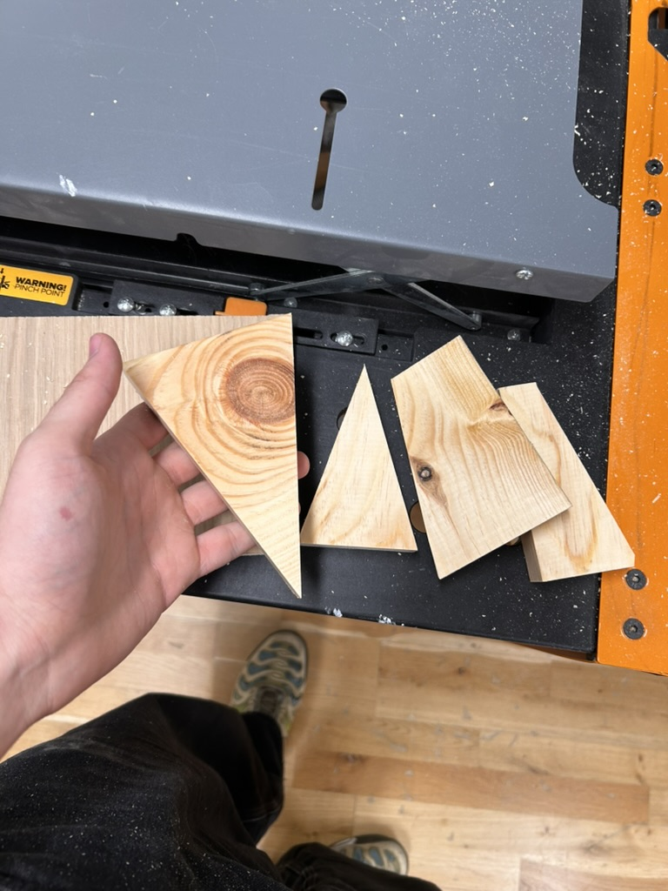

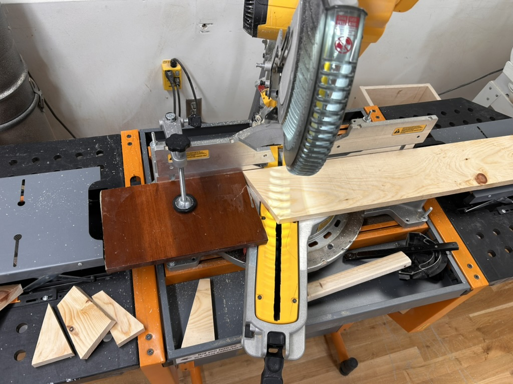

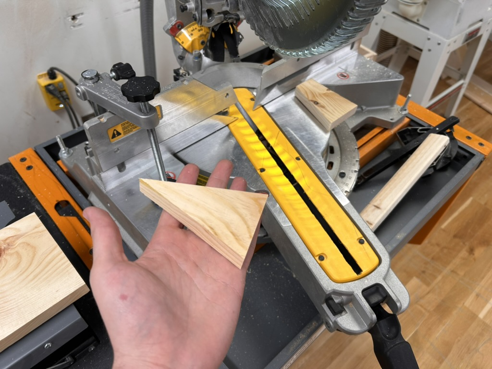

Quite the surprise when I realized I had made a semi-circle. Readjusted and got the 360°.

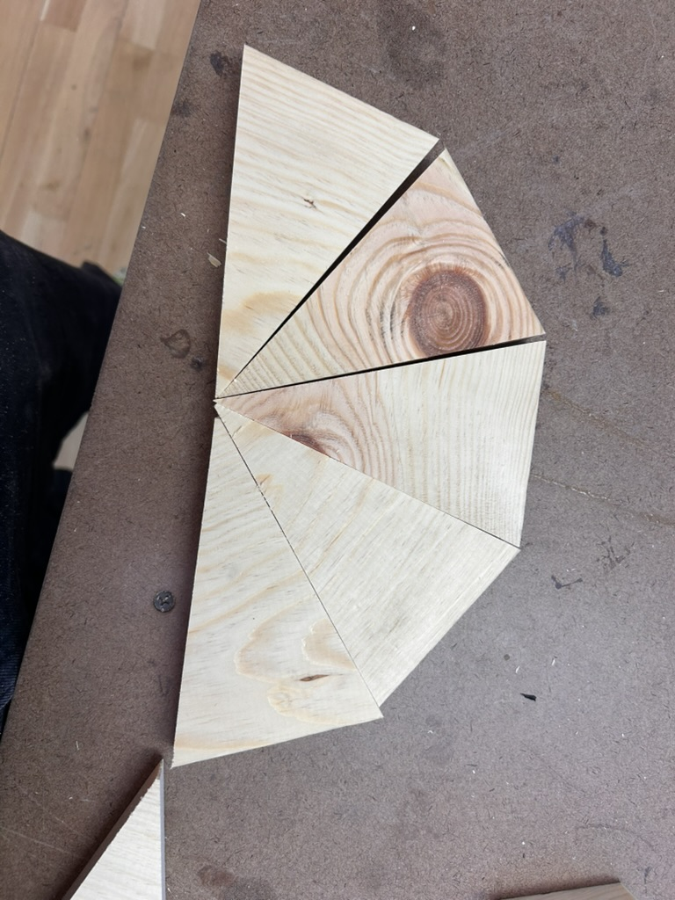

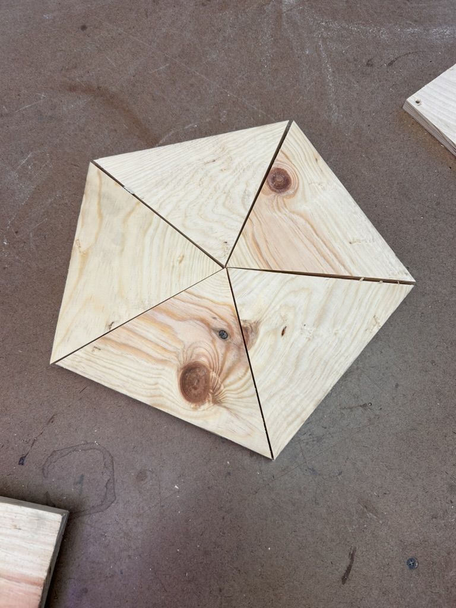

Couldn't quite figure out how to cut out part of the slices to make a crust at first, so toyed with attaching a separate piece as the crust.

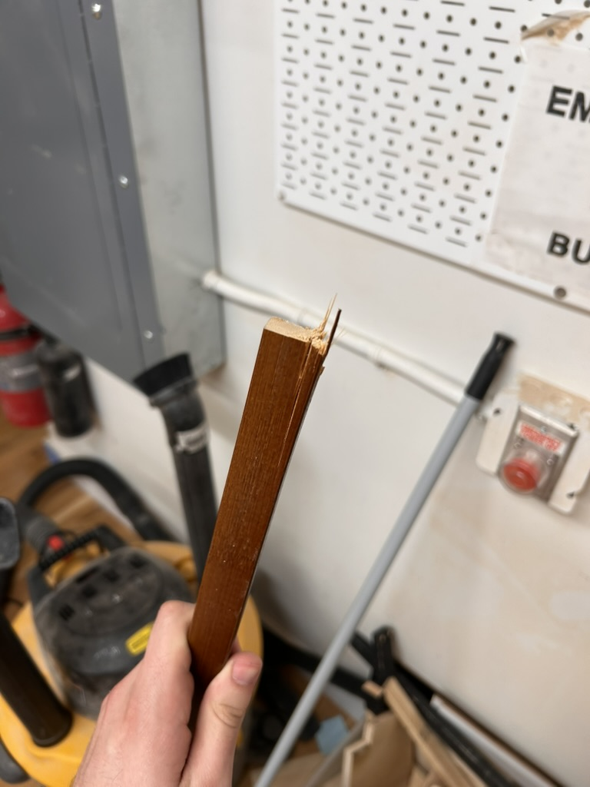

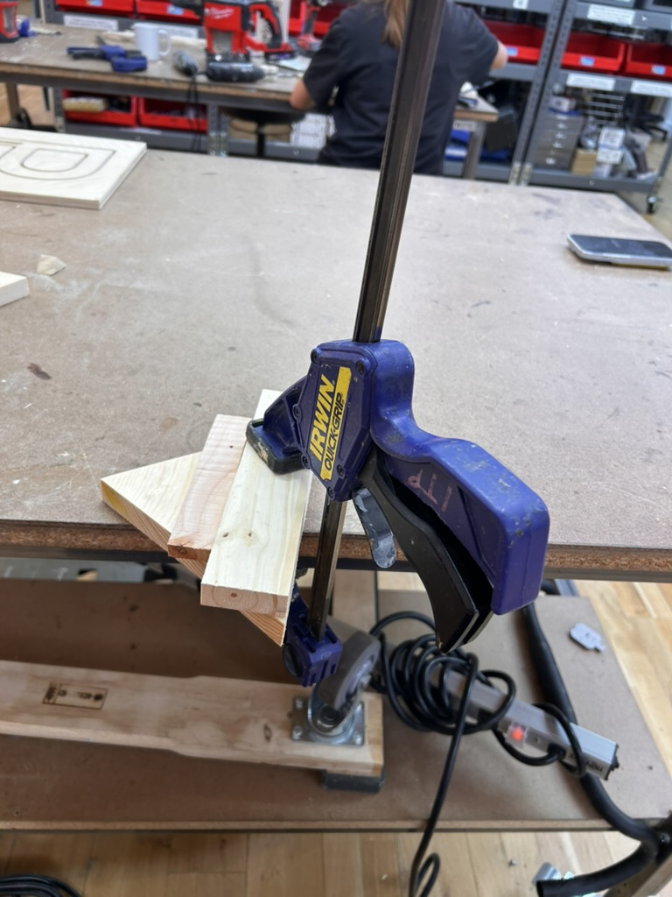

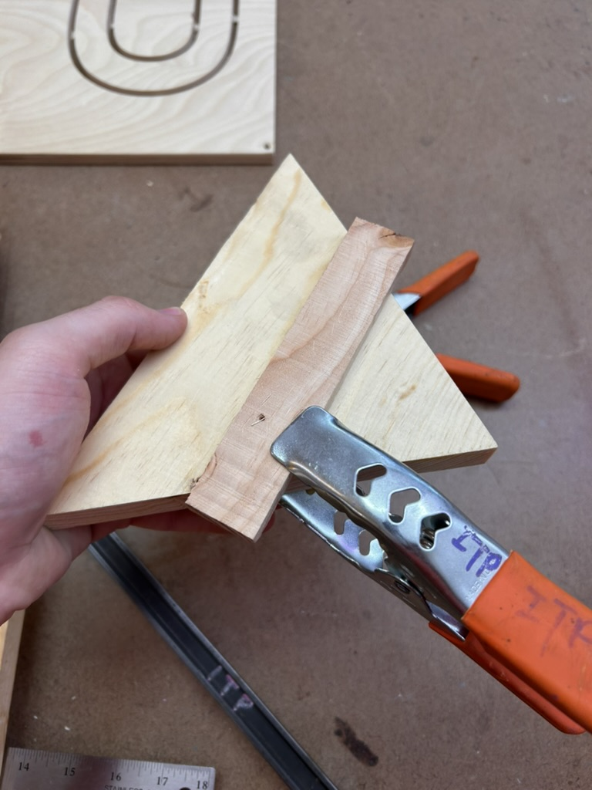

Eventually one of my classmates pointed out I could just use the drill press, and I went from there.

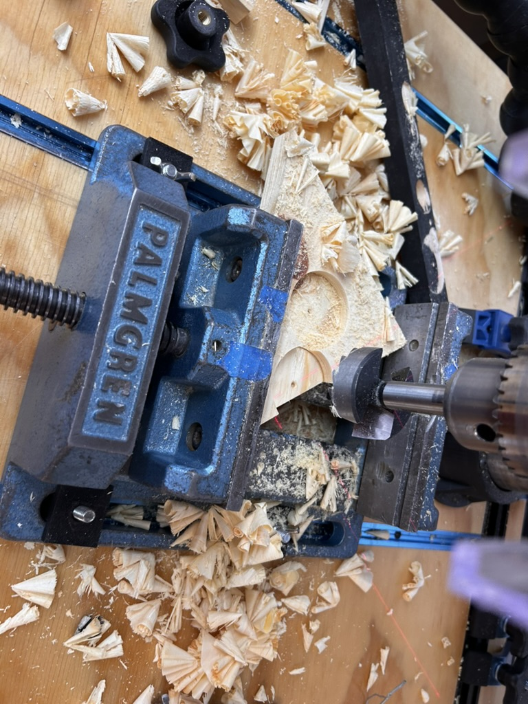

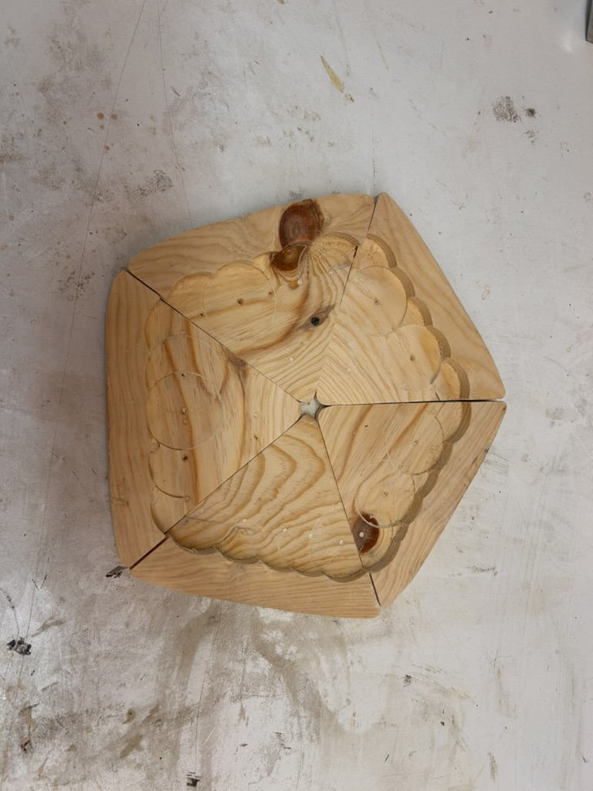

Final product:

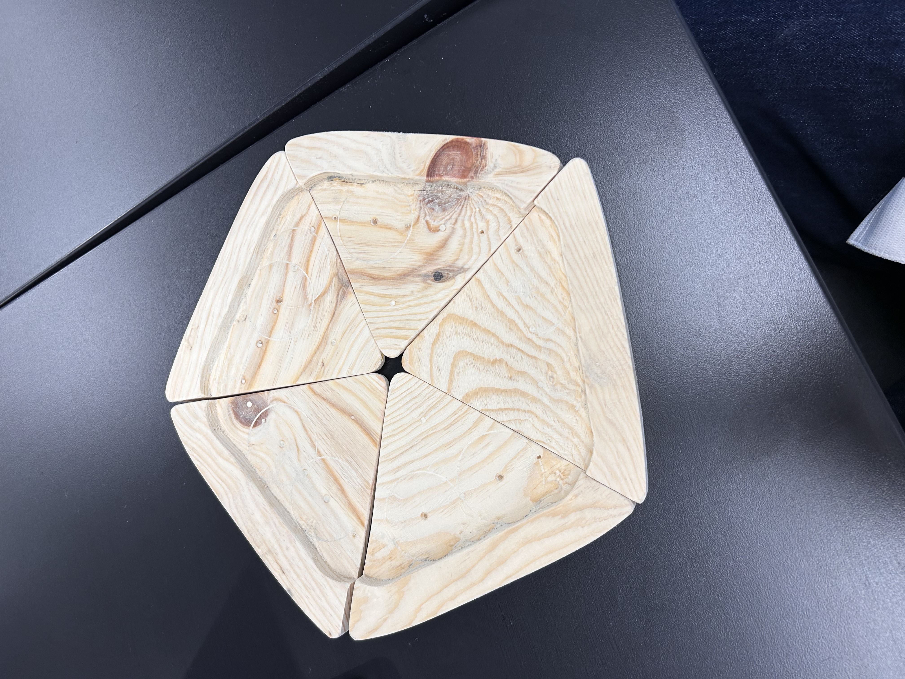

Possible next steps: attaching velcro for mix-and-match toppings
