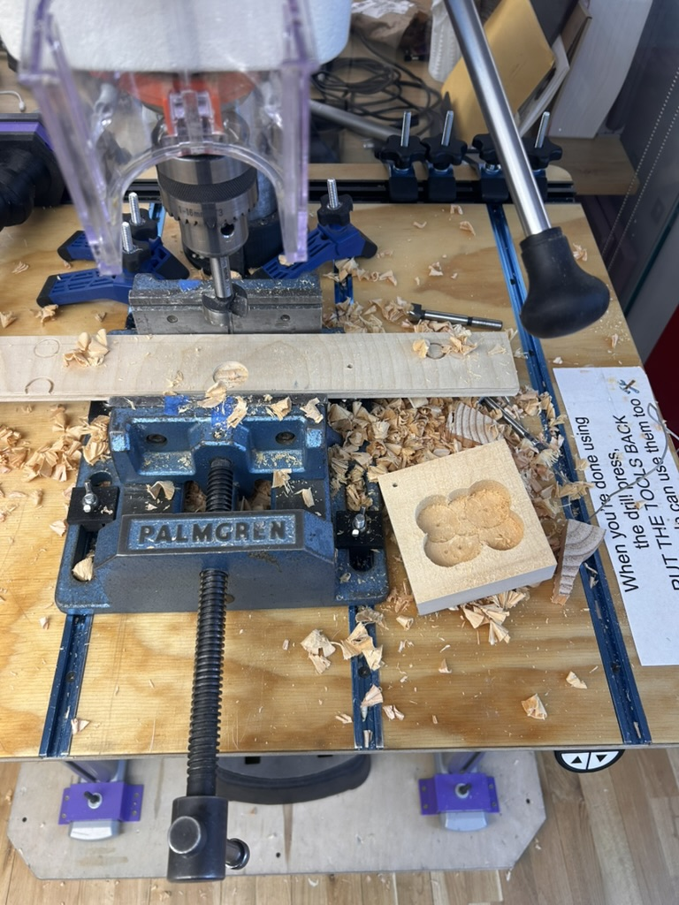
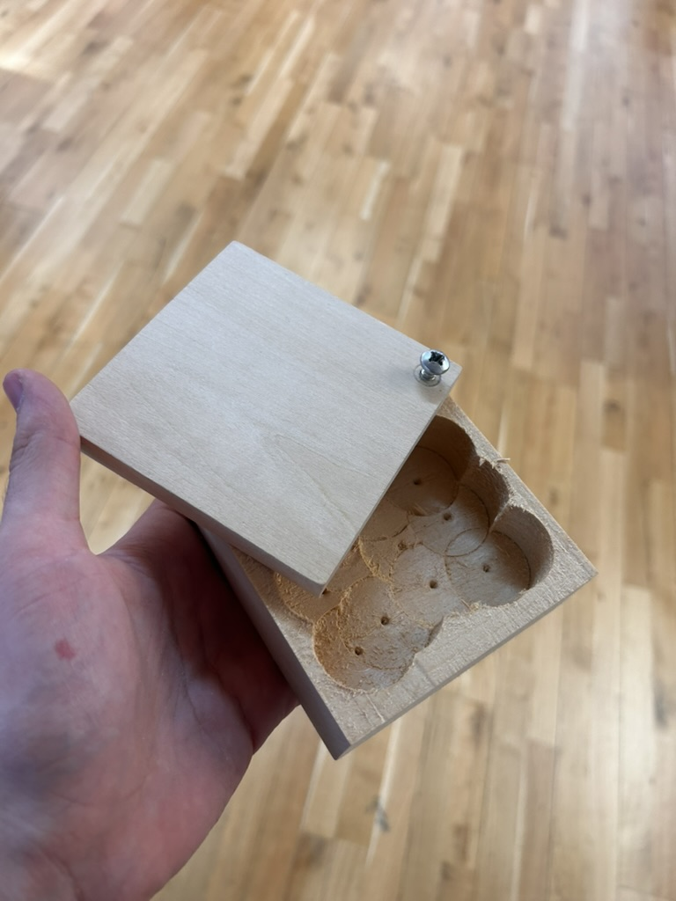

First assignment for this course, (and my first non-reading assignment at all) is to make a wooden box. The point here is just to get familiar with the woodshop and tools.

    
    

Disaster strikes:
*AKA I made the walls too thin and one of them cracked*
![[E842FC35-DD89-4DFE-AF2D-CCECFF401215_1_105_c.jpeg]]
Sanded it out to make it look intentional
*Which doesn't really make sense because why would it need a hole in the side if the top comes off*
![[AD8B6A1C-70B2-4487-9B51-81EC25142E20_1_105_c.jpeg]]