If you are not interested in the rat religion lore I created, you can skip to [[#Designing]] below.

The assignment was to make an enclosure for a bespoke purpose. I considered some things that might fit my New York City theme, such as a case for a single pizza slice or halal plate. But I didn't think those would be very interesting to make. I ended up going pure nonsense mode, and decided to make a rat temple for a rat religion I invented.

I spent probably a full 30 minutes procrastinating actually designing this thing by writing down notes on what the rat religion entails. Here is what I have in my Notes app:

```
Foundational mythology questions:  
Why do rats think they are here in the world?

- rats’ purpose is to serve the world and their fellow rats so that their soul can accumulate merit

What do rats think happens when they die?

- When rats die, their soul is split into many parts - the more virtuous they are, the more merit they have to be split up, so the more rats are birthed from their soul

What do rats think of humans?

- rats are sorry for the black plague, and vow never to let the world fall out of balance again
- they are sympathetic to humans, and feel bad for them more than anything  
    What moral code are rats expected to follow?

What real-world phenomena do rats perceive as supernatural, and what do they think causes them?

- rats view the subway as a place of great danger, but once a month, every rats is required to make a pilgrimage through a significant length of the subway system, as a way of redeeming themselves for the black plague
- the subway cars are divinely sent judges
- rats do not understand that they are sometimes stealing food. They assume that all food they find has been left for them in gratitude 

Rat virtues:

- finding food and bringing it back to their rat home

- pizza above all else

- submitting yourself to the subway’s judgement
- stewarding commuters  
    

Wikipedia: “they are known to invade properties for food, water, warmth, and shelter”
```

## Designing

I was really drawing blanks on what I wanted to do with this for a while, so I started in familiar territory by opening Illustrator, and just designing some iconography for my temple based on the notes I had written about about rat religion. I reused the subway car vector from [[Wooden Subway Car]], and made a plague mask icon using an image as a guideline, to remind the rats of their original sin.

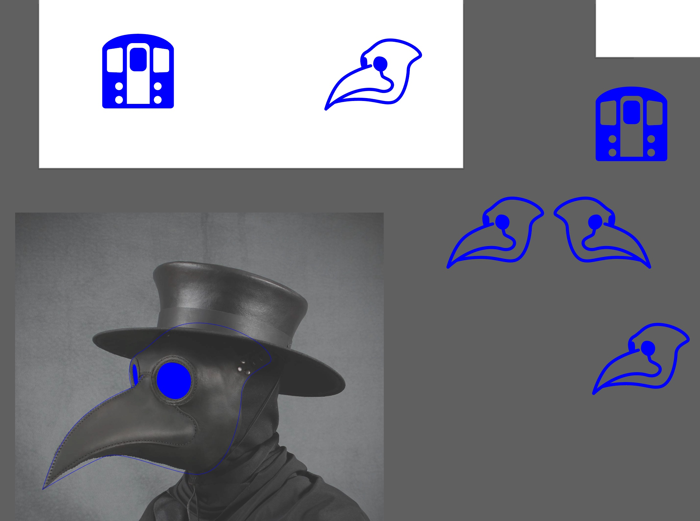

I then had the brilliant idea that the temple should be triangular, like a block of Swiss cheese. Truly genius stuff here.

So I started blocking out the shapes of my walls, thinking about where the slots and grooves of each edge should go so that everything would fit together. I would later find out that I messed this up.

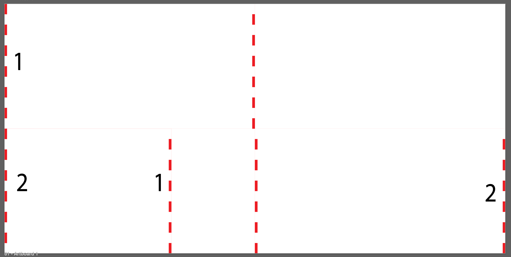

I then created a pizza icon, and made a reusable pattern swatch of the pizza and subway icons to fill the long walls. The short wall I adorned with a mirrored plague mask icons, and carved out an entrance for worshippers to enter. All three walls were given many holes, to further suggest a block of, you guessed it, cheese.

I also made a block of greyscale swatches, which I had engraved first to test how different power levels from the machine would look on my acrylic.

<div style="display:flex;justify-content:center;">

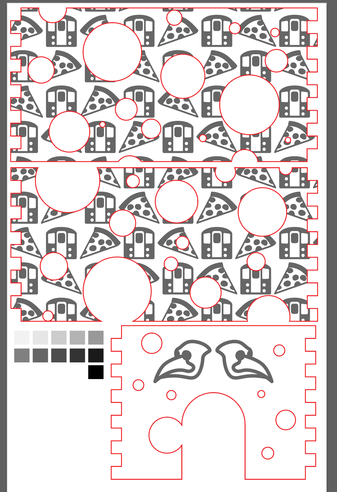

</div>

### Crisis averted, or: How I learned to not be *that guy*

Before I settled on using the same puzzle-style method I've used in previous projects to join the walls together, I was looking for methods that might result in a cleaner look. One of the residents very kindly helped me put something together in #Fusion, which I did get 3D printed. Luckily, some of my classmates remembered that we were instructed not to use 3D printing for anything that was structurally important to the enclosure, and that Phil had even said in class that every year there's one student who ignores this rule, AKA *that guy*. I am lucky I have thoughtful classmates who alerted me to the road I was headed down, and so helped me avoid a dark fate. It was cool to learn a little about Fusion though.

<div class="img-row">

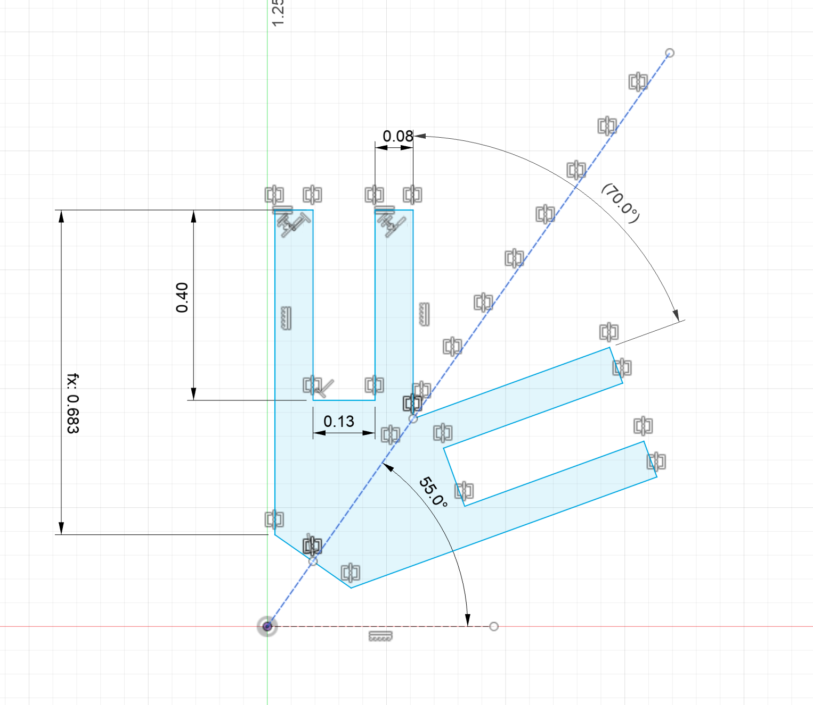

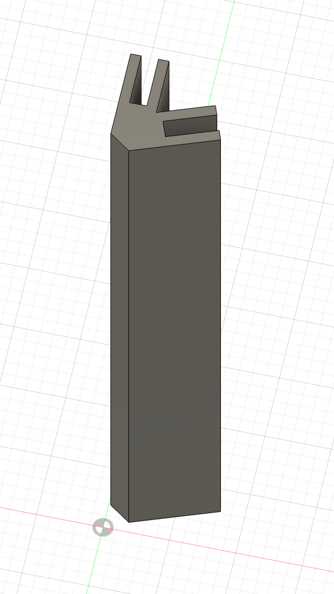

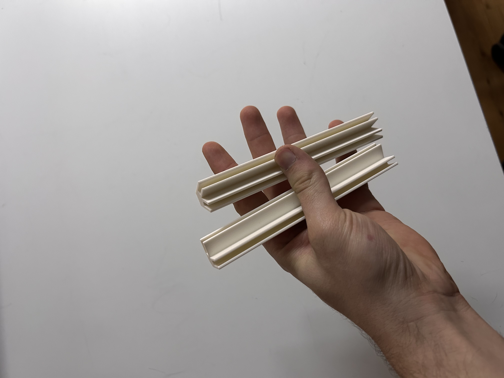

</div>

## Printing

As usual, I had pushed things to the last minute, and so was doing my best to get things done before the laser engraving machines close at 9:30. This meant that I had to stop agonizing and theorizing about what things would look like, and get to it.

I ran the engraving first.

<video src="./Attachments/double_sped.mp4" controls width="100%"></video>

I then started running the vector cut, but realized a few seconds into the run that I had accidentally aligned the grooves on the edges of each wall so that in order for them to fit, one of the walls would have to have it's graphics facing inside. With no time left to fix things for real, I performed some last minute vector surgery on the dedicated laser-engraving laptop. I knew this meant that one of the walls would not have it's pattern extend through the teeth, but I didn't have time to worry about it. It's not noticeable anyway, so I'm feeling fine about it now.

<video src="./Attachments/IMG_6984.mov" controls width="100%"></video>

Leftovers:

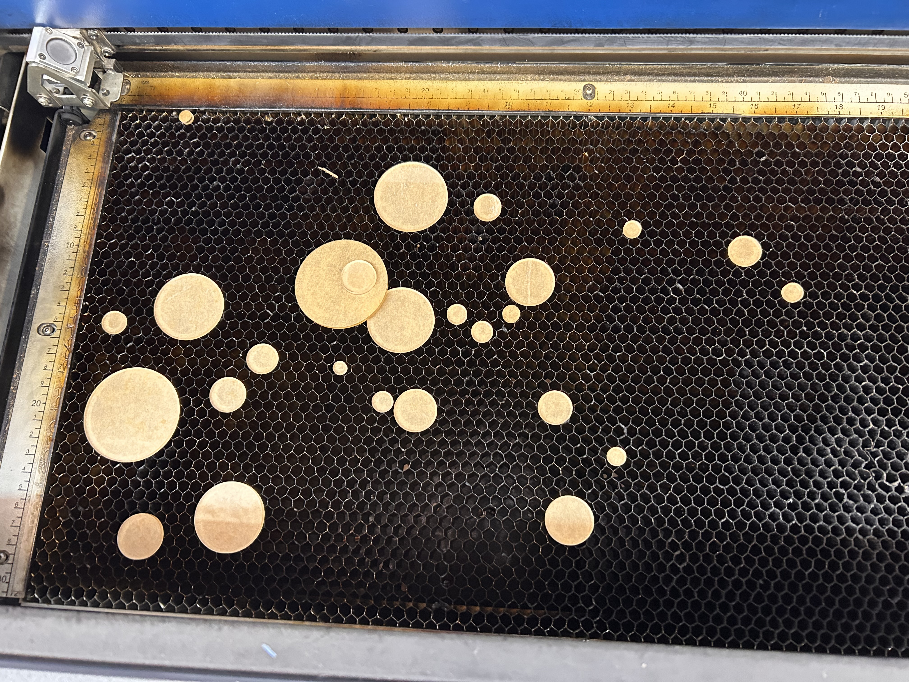

Results:

<div style="display:flex; justify-content:center">

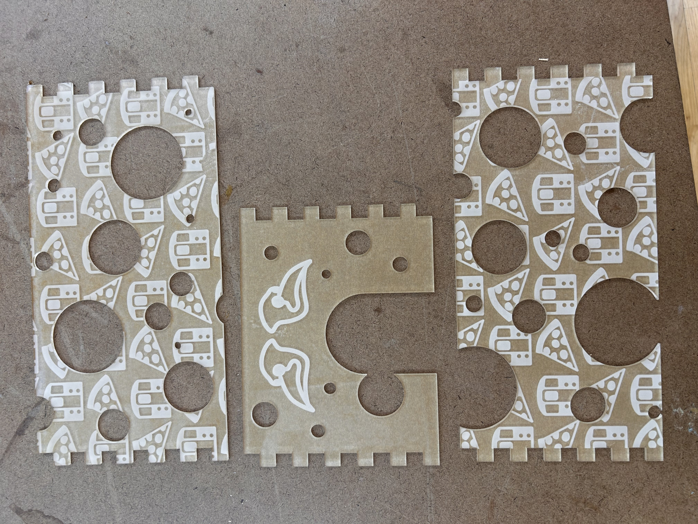

</div>

## Putting it together

I used acrylic cement on the edges where the walls' teeth met, and was surprised at how quickly it dried.

<div style="display:flex; justify-content:center">
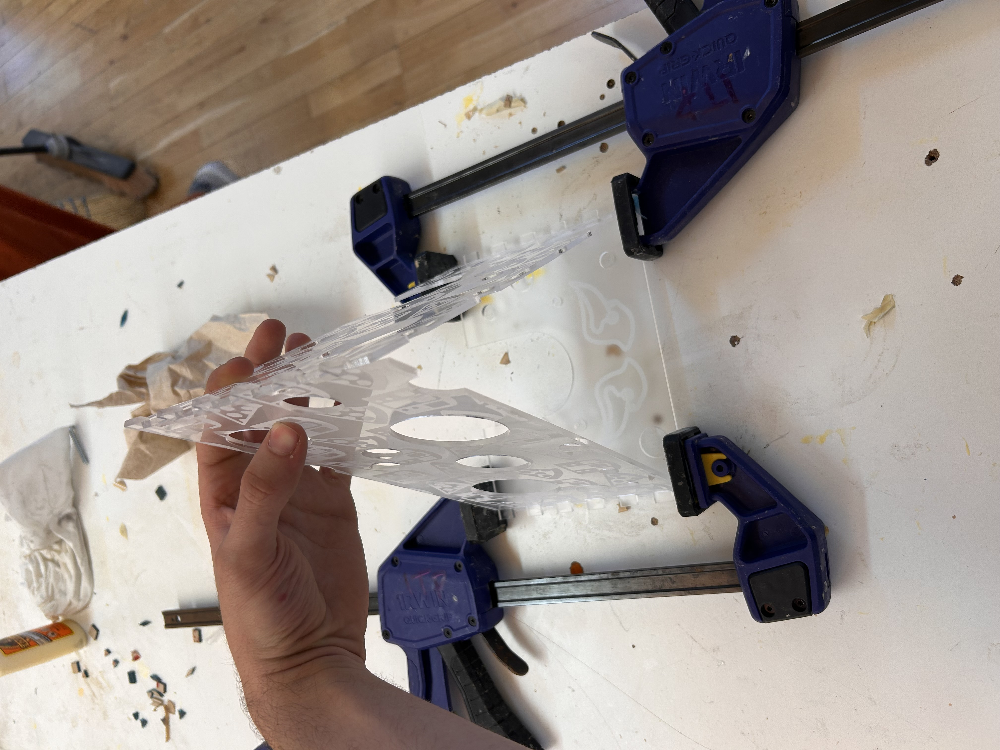
</div>

## Finishing touches

At this point I was relatively pleased with what I had, but there was something obvious missing.

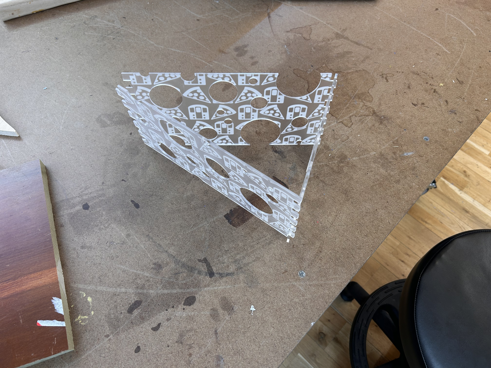

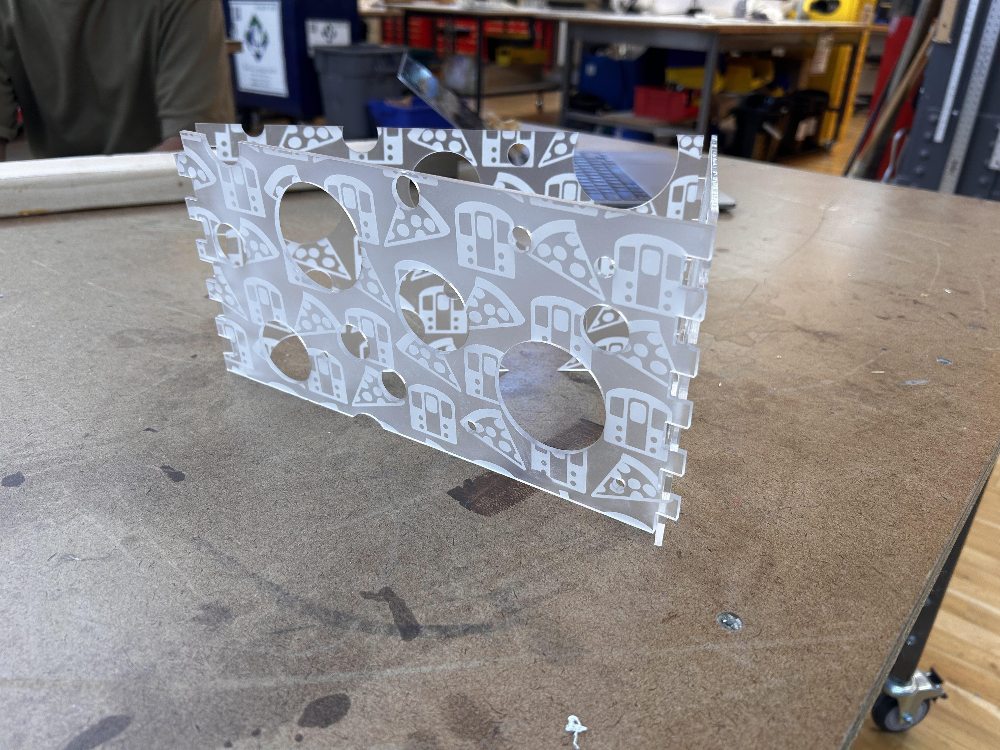

No temple is complete without a worshipper.

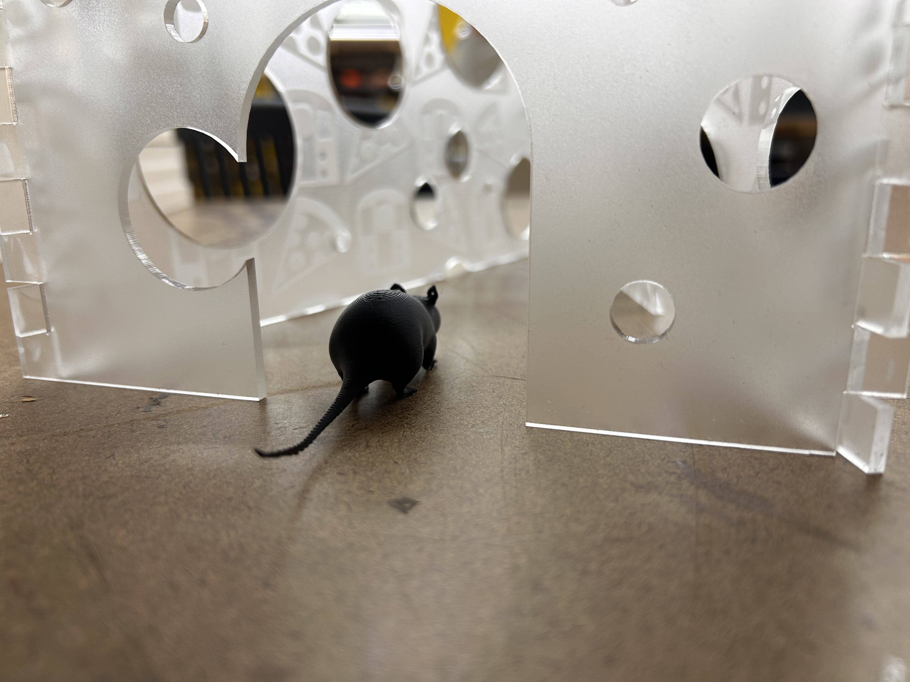
