#wood 

## Overview

The assignment was to make two items, a big one and a small one, using two different materials. We were also to make use of new techniques, like #kerf-bending and joining to make bends and to slot multiple pieces together.

I set out to make a wooden subway car with acrylic windows. I did manage to get the car made as my big item, but didn't have enough time to do the windows or make a smaller accompanying item. Very pleased with what I was able to get done though. Hopefully I can make time to finish it for real with the windows and a floor for the car.

## Illustrator

Started with just loosely blocking things out in #Illustrator, just getting the basic idea down.

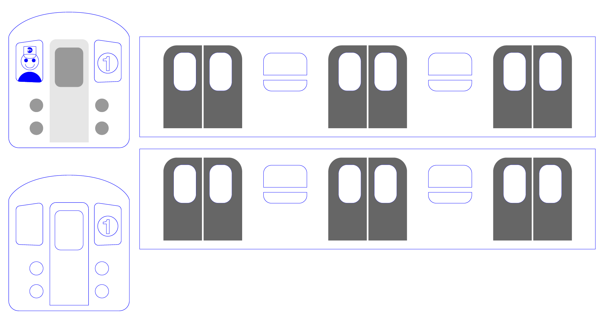

I then thought through which parts need to have a fill (to be engraved) vs a path (to be cut).

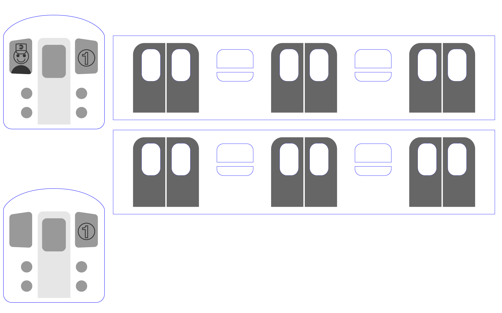

I then had to think about how I wanted the roof of the car to work. I considered making it a separate piece and then joining it with the sides and faces, but I thought it would be cool to get a curved piece using kerf-bending, which would allow me to have one big piece for the roof and sides.

Some research online lead me to [this kerf-bending pattern generator](https://kerfsmith.com/web-app.html) which made things relatively easy. 

Ian, who works in the shop, was super helpful throughout this process. One thing he showed me was how to get the length of a curved path in Illustrator using the document info window. (I've been using Illustrator for 9 years and had no idea!) Using that information, I blocked out the corresponding amount of space for the kerf-bending pattern, downloaded an SVG with those dimensions from the site I found, and had this:

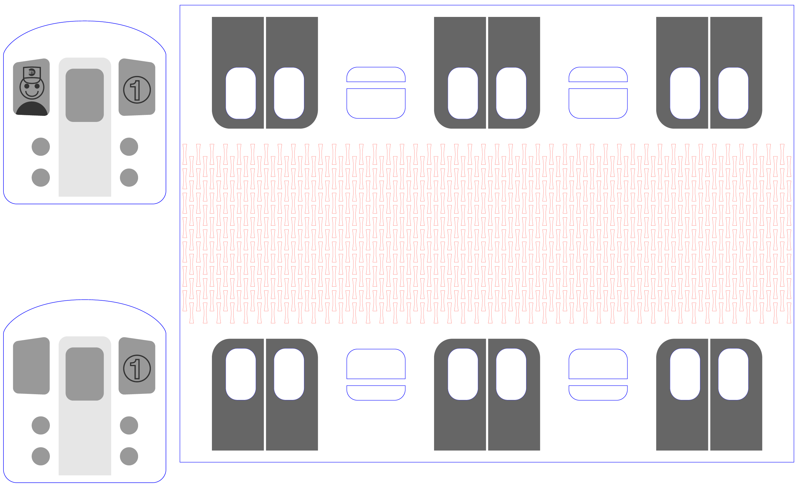

## Test runs

Following Ian's advice, I did some small test prints before sending in my full thing. First was a test of just my kerf-bending. This turned out to be pretty important, since the pattern I had at first was way too stiff to bend all the way. I put the spacing between cuts down by a few points in the pattern generator, made another test print, and was happy enough with those results to continue. Below is my first test, and then a comparison of my first and second tests.

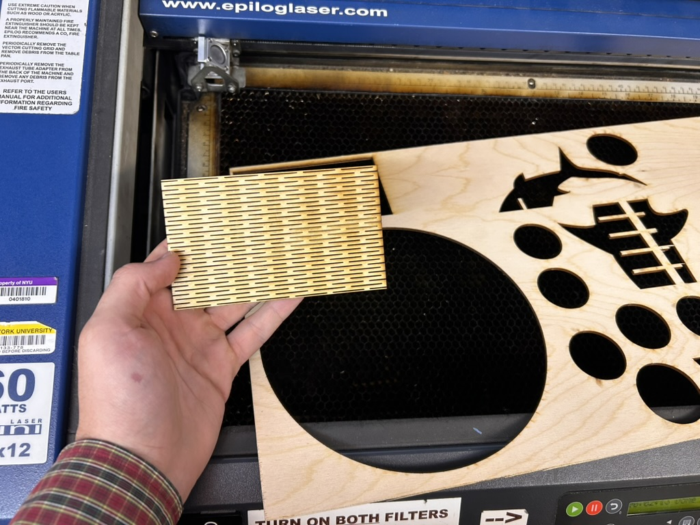

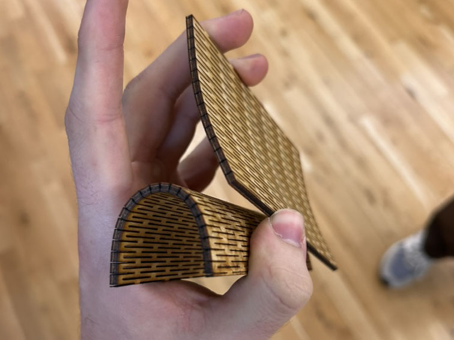

I then printed a small subsection of my main piece, as well as several swatches at different values to test how different power levels of the laser would show on my plywood.

The subsection confirmed that things were good to go in terms of the shapes, but the swatches showed me that I had my fills way too dark in Illustrator, so I adjusted.

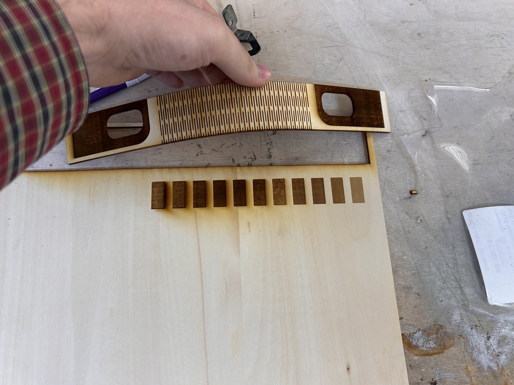

## Printing

Some clips of the Mini Helix running. The first two are sped up.

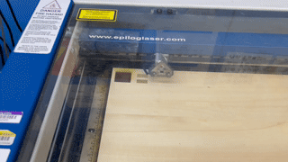

<video src="./Attachments/laser-timelapse.mp4" controls autoplay loop width="100%"></video>

<video src="./Attachments/window_cutout.mp4" controls autoplay loop width="100%"></video>

The residue:

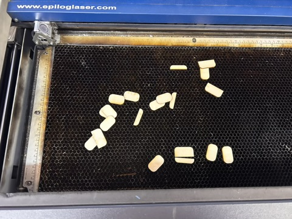

Results:

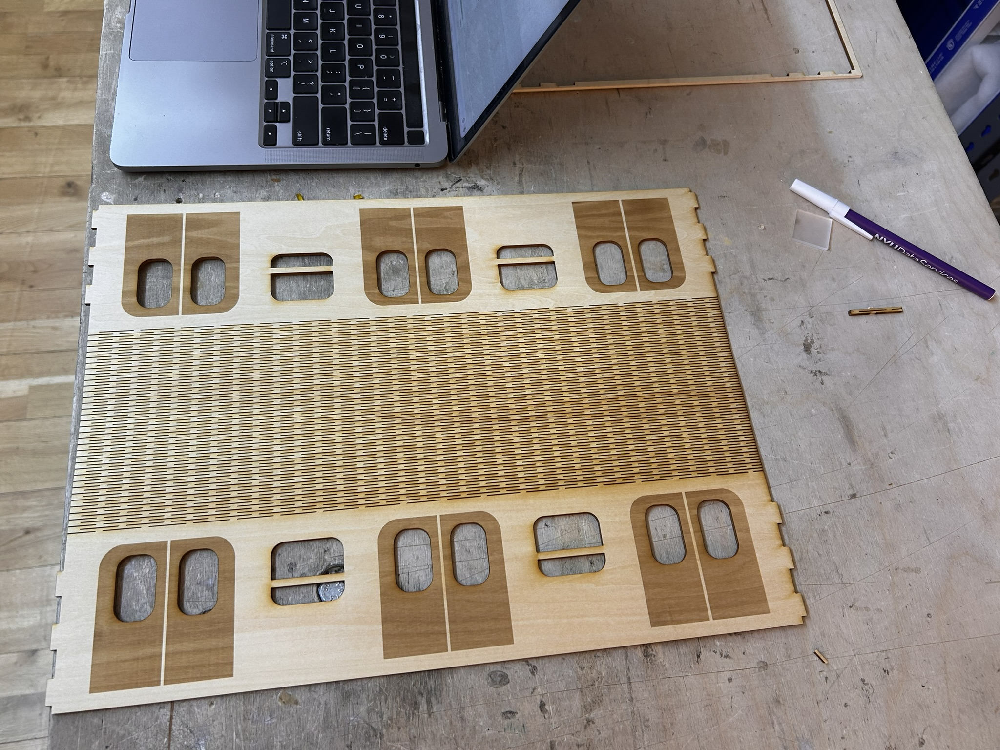

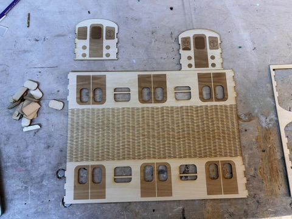

## Assembly

I used two press clamps to keep the shape overnight while the glue dried.

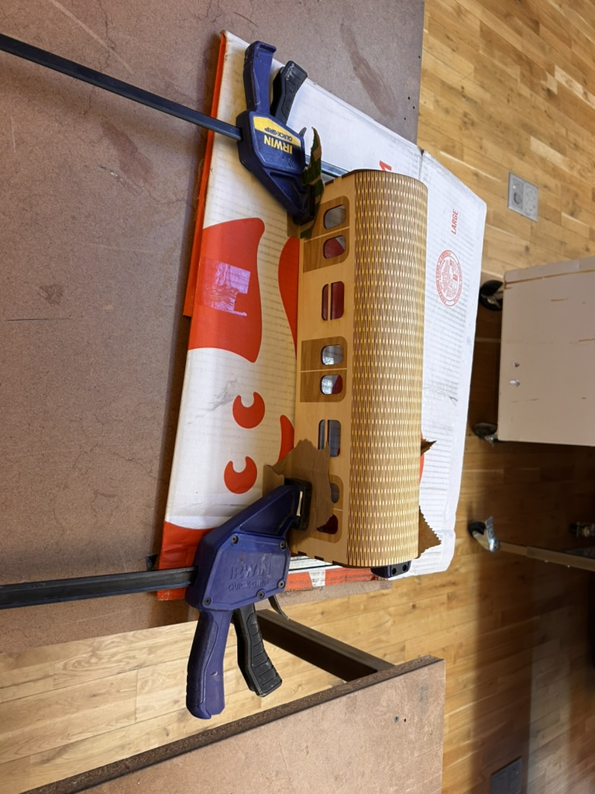

## Results

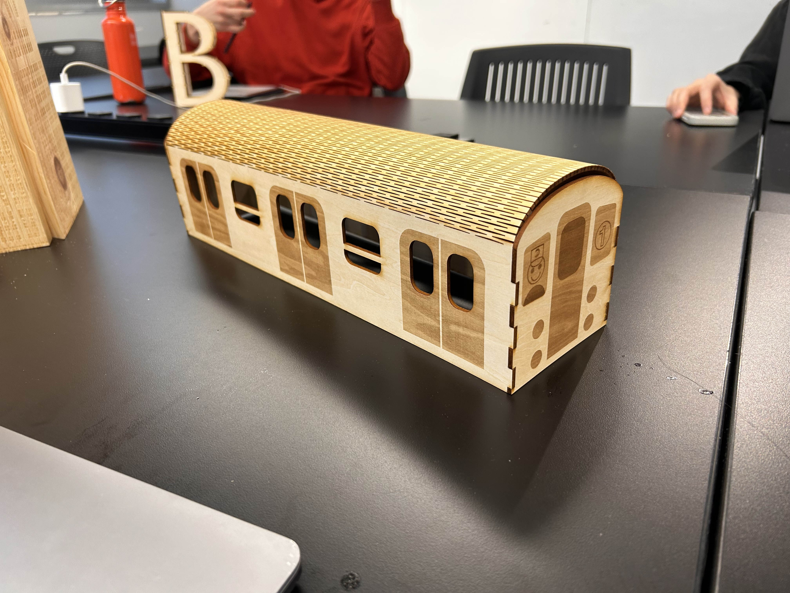

I hope to update this later with windows, a floor, and possibly some way of getting the roof to be more flush with the faces.
